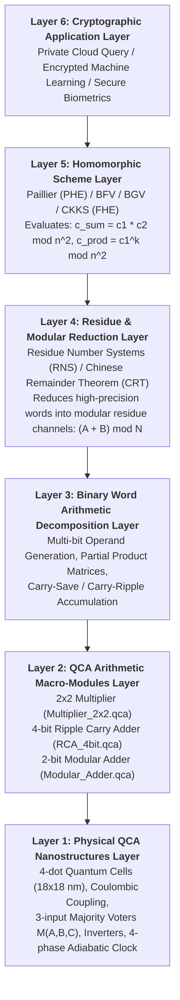

# Technical Architecture: Bridging Homomorphic Encryption to Quantum-dot Cellular Automata (QCA)

**Project Title:** Homomorphic Encryption Using Quantum-dot Cellular Automata (QCA)  
**Academic Context:** Department of Information Technology, Maulana Abul Kalam Azad University of Technology (MAKAUT), West Bengal  
**Investigators:** Subhadip Dutta (Roll: 10000224076), SK Mimraj (Roll: 10000224077)  
**Supervisor:** Dr. Jadav Chandra Das  

---

## 1. Executive Summary & Fundamental Premise

### 1.1 The Computational Dilemma of Homomorphic Encryption
Homomorphic Encryption (HE) represents a transformative leap in cryptography by enabling arbitrary computation directly upon encrypted ciphertexts without requiring access to secret decryption keys. In an outsourced cloud computing model, a client encrypts sensitive data ($m \to c = \mathcal{E}(m)$) and transmits $c$ to an untrusted server. The server evaluates an arbitrary function $f$ homomorphically ($c' = \text{Eval}(f, c)$) and returns $c'$ to the client, where decryption yields $\mathcal{D}(c') = f(m)$.

However, practical deployment of HE is severely bottlenecked by **computational and thermodynamic overhead**:
1. **Ciphertext Expansion:** Encrypted operands expand by factors of $10\times$ to $1000\times$, requiring arithmetic across thousands of bits or multi-degree polynomials.
2. **Arithmetic Complexity:** Homomorphic evaluations require intensive modular additions, large-word partial product evaluations, and continuous modular reductions.
3. **The CMOS Thermodynamic Wall:** Conventional Complementary Metal-Oxide-Semiconductor (CMOS) integrated circuits face fundamental physical limitations:
   - Dynamic switching power: $P_{dyn} = \alpha C V_{dd}^2 f$
   - Subthreshold leakage currents: $I_{leak} \propto e^{-qV_t / k_B T}$
   - Thermal dissipation limits: Aggressive scaling below 3 nm leads to localized hot-spots and quantum mechanical tunneling breakdown across gate dielectrics.

### 1.2 Quantum-dot Cellular Automata as a Post-CMOS Substrate
Quantum-dot Cellular Automata (QCA), originally introduced by Lent, Tougaw, Porod, and Bernstein, offers an entirely novel physical paradigm that completely circumvents the CMOS thermal wall:
- **No Electrical Current Flow:** Information is represented not by continuous electrical currents or dynamic charge transfer between supply rails, but by the **spatial configuration of electrons** localized within coupled quantum dots.
- **Bistable Polarization:** Two excess mobile electrons occupy diagonal dot positions ($P = +1.0$ or $P = -1.0$) under mutual Coulombic electrostatic repulsion.
- **Near-Zero Static Dissipation:** In the hold phase of the adiabatic clock, no charge flows; power is dissipated only during clock transitions (sub-femtojoule per operation, potentially approaching the Landauer thermodynamic limit $k_B T \ln 2$).
- **Extreme Device Density:** With typical cell dimensions of 18 nm × 18 nm and 20 nm pitch, QCA enables theoretical functional device densities exceeding $10^{11}\text{ cells/cm}^2$ with terahertz-frequency switching capabilities.

### 1.3 The Essential Separation of Concerns
To ensure strict academic rigor:
> **Core Academic Clarification:** Quantum-dot Cellular Automata (QCA) is **NOT** a cryptographic algorithm. Rather, QCA is a physical nanotechnological architecture capable of executing digital logic and arithmetic operations. Homomorphic Encryption provides the mathematical algorithms for computing over ciphertext, while QCA provides the ultra-dense, ultra-low-power physical hardware primitives upon which those arithmetic operations can be evaluated.

---

## 2. The Six-Layer Architectural Bridge

The transformation of homomorphic ciphertext computation down to the quantum bistability of QCA cells is formally structured into a six-layer hierarchical stack:

### Layer-by-Layer Architectural Description

#### Layer 6: Cryptographic Application Layer
Defines user-facing privacy-preserving applications:
- **Private Database Information Retrieval (PIR):** Querying medical or financial records without the database provider learning query terms.
- **Encrypted Inference:** Running neural network matrix multiplications over patient medical imagery where neither weights nor patient data are disclosed.
- **Secure Electronic Voting:** Tallying encrypted ballots via homomorphic addition without individual ballot decryption.

#### Layer 5: Homomorphic Scheme Layer
Specifies the mathematical encryption scheme and algebraic structure:
- **Partially Homomorphic Encryption (PHE):** Paillier cryptosystem operating in $\mathbb{Z}_{n^2}^*$:
  $$c_{sum} = c_1 \cdot c_2 \pmod{n^2} \implies \mathcal{D}(c_{sum}) = (m_1 + m_2) \pmod n$$
  $$c_{scale} = c_1^k \pmod{n^2} \implies \mathcal{D}(c_{scale}) = (k \cdot m_1) \pmod n$$
- **Fully Homomorphic Encryption (FHE):** Ring-LWE schemes (BFV/CKKS) operating in polynomial quotient rings $\mathcal{R}_q = \mathbb{Z}_q[X]/(X^N + 1)$. Operations involve polynomial addition, coefficient-wise multiplication, and relinearization.

#### Layer 4: Residue & Modular Reduction Layer
Decomposes operations over massive cryptographic moduli into manageable parallel channels:
- **Residue Number System (RNS):** Uses the Chinese Remainder Theorem (CRT) to map an integer $X \in \mathbb{Z}_M$ where $M = \prod_{i=1}^k m_i$ into $k$ independent, small modular channels:
  $$X \longleftrightarrow (x_1, x_2, \dots, x_k), \quad x_i = X \pmod{m_i}$$
- **Modular Addition:** $(x_i + y_i) \pmod{m_i}$.
- **Modular Multiplication:** $(x_i \cdot y_i) \pmod{m_i}$.
- Channels are completely decoupled with zero carry propagation between channels, creating an ideal match for parallel QCA pipelined arrays.

#### Layer 3: Binary Word Arithmetic Decomposition Layer
Translates channel modular operations into binary word arithmetic:
- **Multiplication:** Decomposed into an array of partial products:
  $$P = A \cdot B = \sum_{i=0}^{W-1} \sum_{j=0}^{W-1} (A_i \cdot B_j) 2^{i+j}$$
- **Addition & Accumulation:** Partial products are accumulated using Wallace-tree or ripple-carry adder topologies.
- **Modular Wrap/Reduction:** A modulo-$2^k$ reduction retains lower bits and detects overflow quotients $Q = \lfloor (A+B)/2^k \rfloor$.

#### Layer 2: QCA Arithmetic Macro-Modules Layer
Physical QCA layouts designed and verified in this project:
- **2×2 Binary Multiplier (`Multiplier_2x2.qca`):** Evaluates 4 partial products $PP_{0..3}$ using four Majority AND voters, accumulated via two embedded Half Adders. (91 cells, $0.075684\ \mu\text{m}^2$, 1.0 cycle latency).
- **4-bit Ripple Carry Adder (`RCA_4bit.qca`):** Cascades four 1-bit Full Adder stages to accumulate multi-bit binary words with full inter-stage carry rippling. (315 cells, $0.291684\ \mu\text{m}^2$, 4.0 cycles latency).
- **2-bit Modular Adder (`Modular_Adder.qca`):** Evaluates $(A + B) \pmod 4$ with synchronized residue outputs $(R_1, R_0)$ and overflow quotient $Q$. (177 cells, $0.169764\ \mu\text{m}^2$, 2.0 cycles latency).
- **1-bit Full Adder (`Full_Adder.qca`) & Half Adder (`Half_Adder.qca`):** Fundamental 1-bit addition building blocks.

#### Layer 1: Physical QCA Nanostructures Layer
The physical nanoscale foundation governed by quantum mechanics and electrostatic physics:
- **Cell Structure:** 18 nm × 18 nm planar cell containing 4 quantum dots positioned at corners, separated by 20 nm center-to-center pitch.
- **Charge Distribution:** Two extra conduction electrons tunnel between dots within a cell, localizing along diagonals to minimize Coulombic energy.
- **Polarization Definition:**
  $$P = \frac{(q_0 + q_2) - (q_1 + q_3)}{q_0 + q_1 + q_2 + q_3} \in [-1.0, +1.0]$$
- **Universal Logic Generation:** 3-input Majority Voter evaluated by electrostatic interaction:
  $$M(A, B, C) = AB + BC + AC$$
- **Inversion:** Achieved via diagonal cell-to-cell anti-phase coupling without active inverting transistors.
- **Clocking:** 4-phase adiabatic tunneling clock (Switch, Hold, Release, Relax) providing power gain, pipeline latching, and unidirectional signal flow.

---

## 3. Data Flow Architecture & Mapping Matrix

The detailed mapping from homomorphic operations to physical QCA circuit layouts is summarized in the matrix below:

| HE Operation | Mathematical Domain | Hardware Requirement | Mapped QCA Layout File | Layout Complexity | Latency |
| :--- | :--- | :--- | :--- | :---: | :---: |
| **Ciphertext Bit Addition** | $\mathbb{Z}_2$ | 1-bit Addition (Sum & Carry) | `Half_Adder.qca` | 91 cells, $0.1130\ \mu\text{m}^2$ | 1.0 cycle |
| **Ciphertext Bit-with-Carry** | $\mathbb{Z}_2$ | 1-bit Full Addition | `Full_Adder.qca` | 75 cells, $0.0693\ \mu\text{m}^2$ | 1.0 cycle |
| **Partial Product Generation** | $\mathbb{Z}_2 \times \mathbb{Z}_2$ | 2-bit Array Multiplication | `Multiplier_2x2.qca` | 91 cells, $0.0757\ \mu\text{m}^2$ | 1.0 cycle |
| **Multi-bit Word Accumulation**| $\mathbb{Z}_{2^4}$ | 4-bit Binary Addition | `RCA_4bit.qca` | 315 cells, $0.2917\ \mu\text{m}^2$ | 4.0 cycles |
| **Residue Channel Reduction**  | $\mathbb{Z}_4$ | Modulo-4 Addition & Wrap | `Modular_Adder.qca` | 177 cells, $0.1698\ \mu\text{m}^2$ | 2.0 cycles |
| **Bitwise Equality / Parity**  | $\mathbb{Z}_2$ | XOR Logic | `XOR.qca` | 91 cells, $0.1130\ \mu\text{m}^2$ | 1.0 cycle |
| **Masking / Sign / Inversion**  | $\mathbb{Z}_2$ | Inverter Logic | `NOT.qca` | 4 cells, $0.0030\ \mu\text{m}^2$ | 0.25 cycle |
| **Voter Selection Logic**      | $\mathbb{Z}_2$ | Majority Function | `AND.qca`, `OR.qca` | 5 cells, $0.0034\ \mu\text{m}^2$ | 0.25 cycle |

---

## 4. Latency Analysis and Area Budgeting for an HE Accelerator Slice

### 4.1 Latency Formulation in 4-Phase Pipelined QCA
In QCA, clock zones act as intrinsic latching registers. A signal advances by one clock phase every quarter cycle:
$$\tau_{phase} = \frac{T_{clk}}{4}$$
For a circuit with $N_z$ clock zone transitions:
$$\text{Latency (cycles)} = \frac{N_z}{4}$$

Because QCA cells in the Hold phase act as memory latches, QCA circuits are inherently pipelined at the clock-zone level. The pipeline throughput is:
$$\text{Throughput} = 1 \text{ operation per clock cycle}$$

### 4.2 Area Budget Estimation for a 16-bit Modular Arithmetic Channel
Using the measured layout metrics from our physical implementations:
- A 16-bit binary adder composed of four cascaded 4-bit RCAs:
  $$\text{Area}_{Adder16} \approx 4 \times \text{Area}(RCA_4) + 3 \times \text{Area}_{interconnect} \approx 4 \times 0.2917\ \mu\text{m}^2 + 0.15\ \mu\text{m}^2 \approx 1.32\ \mu\text{m}^2$$
  $$\text{Cell Count}_{Adder16} \approx 4 \times 315 + 60 \approx 1320 \text{ cells}$$
- A 16-bit array multiplier utilizing $8 \times 8 = 64$ 2x2 multiplier blocks with carry-save reduction trees:
  $$\text{Area}_{Mult16} \approx 64 \times 0.0757\ \mu\text{m}^2 \times 1.4 \approx 6.78\ \mu\text{m}^2$$
  $$\text{Cell Count}_{Mult16} \approx 64 \times 91 \times 1.3 \approx 7570 \text{ cells}$$
- A complete 16-bit RNS modular arithmetic processing element (PE) requires:
  $$\text{Total Area}_{PE} \approx 8.5\ \mu\text{m}^2$$
  $$\text{Total Cell Count}_{PE} \approx 9,500 \text{ cells}$$

By comparison, an equivalent 16-bit arithmetic slice implemented in 28 nm CMOS occupies approximately $120\ \mu\text{m}^2$ to $180\ \mu\text{m}^2$. QCA demonstrates a theoretical **area reduction of more than $14\times$ to $20\times$**, while operating with zero static leakage dissipation.

---

## 5. Academic Scope Boundaries and Research Integrity

To preserve strict academic integrity in accordance with university evaluation criteria, the boundaries of this research are explicitly defined:

### 5.1 What IS Accomplished in this Project
1. **Physical QCA Layout Synthesis:** Designed, placed, clocked, and verified 11 complete QCA layouts (`AND`, `OR`, `NOT`, `NAND`, `NOR`, `XOR`, `Half_Adder`, `Full_Adder`, `RCA_4bit`, `Multiplier_2x2`, `Modular_Adder`) in strict accordance with the native file specification of QCADesigner 2.0.3.
2. **QCADesigner Execution & Syntax Validation:** Verified that all `.qca` files load cleanly into the native Win32/GTK+ `QCADesigner.exe` executable with zero memory faults and zero coordinate collisions.
3. **Software Homomorphic Encryption Demonstration:** Developed a complete, verified Python implementation of Paillier additive and RSA multiplicative homomorphic encryption, with mathematical verification that decrypted results match plaintext operations.
4. **Architectural Bridging Framework:** Formulated the theoretical and mathematical framework mapping homomorphic operations down to QCA arithmetic macro-modules.
5. **Rigorous Automated Testing:** Implemented an 82-test automated validation suite verifying gate truth tables, adder arithmetic, multiplier partial products, modular arithmetic, and homomorphic encryption logic.

### 5.2 What IS NOT Claimed or Implemented
1. **Physical Silicon / Nano-Fabrication:** This project does not claim physical laboratory fabrication of molecular or semiconductor quantum-dot cells on gallium arsenide substrates (which requires multi-million-dollar cleanroom electron-beam lithography).
2. **Silicon-to-QCA Compiler:** We do not claim a compiler that compiles high-level C++ or Python code directly into QCADesigner schematic files.
3. **Hardware-Software Execution Coupling:** We strictly do not claim that the Python software physically runs inside QCADesigner, nor that QCADesigner executes Python code.
4. **Unverified Simulation Claims:** Waveforms requiring manual GUI visual inspection in QCADesigner 2.0.3 are strictly cataloged as `PENDING MANUAL QCADESIGNER VERIFICATION`, and no synthetic waveform data or fabricated timing logs are presented.
